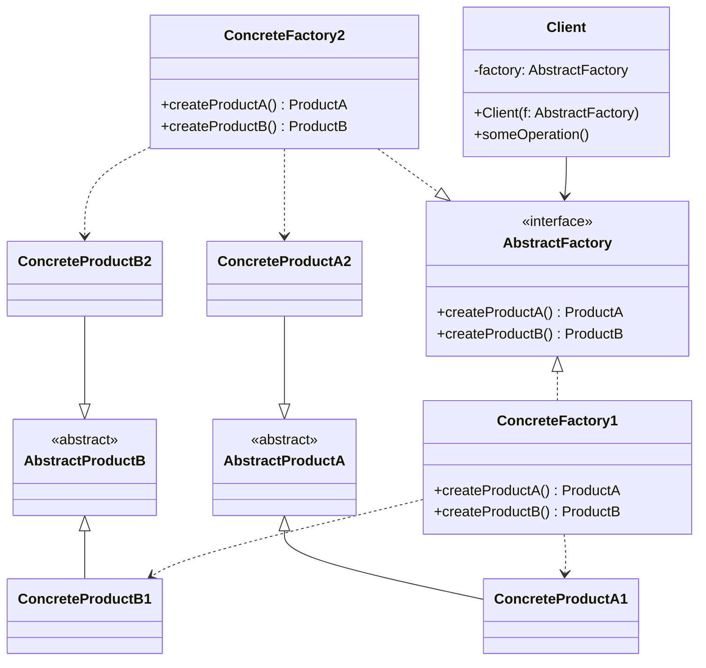

```mermaid
classDiagram
  class AbstractProductA {
    <<abstract>>
  }
  AbstractProductA <|-- ConcreteProductA1
  ConcreteProductA2 --|> AbstractProductA

  class AbstractProductB {
    <<abstract>>
  }
  AbstractProductB <|-- ConcreteProductB1
  ConcreteProductB2 --|> AbstractProductB

  class ConcreteFactory1 {
    +createProductA() ProductA
    +createProductB() ProductB
  }
  class AbstractFactory {
    <<interface>>
    +createProductA() ProductA
    +createProductB() ProductB    
  }
  class ConcreteFactory2 {
    +createProductA() ProductA
    +createProductB() ProductB
  }

  AbstractFactory <|.. ConcreteFactory1
  ConcreteFactory2 ..|> AbstractFactory
  
  class Client {
    -factory: AbstractFactory
    +Client(f: AbstractFactory)
    +someOperation()
  }

  ConcreteFactory1 ..> ConcreteProductB1
  ConcreteFactory1 ..> ConcreteProductA1

  ConcreteFactory2 ..> ConcreteProductB2
  ConcreteFactory2 ..> ConcreteProductA2

  Client --> AbstractFactory
```