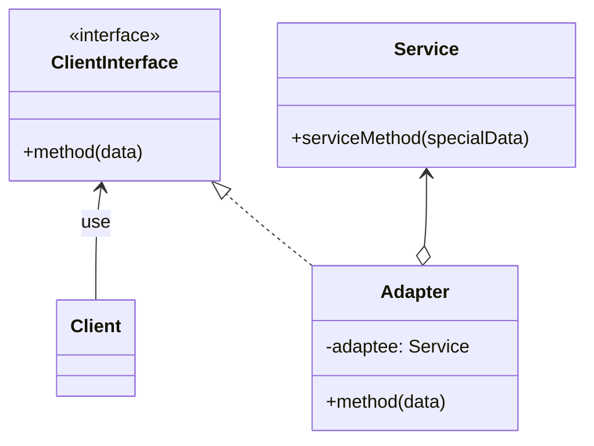

```mermaid
classDiagram
  direction BT
  class Client
  class ClientInterface {
    <<interface>>
    +method(data)
  }
  class Adapter {
    -adaptee: Service
    +method(data)
  }
  class Service {
    +serviceMethod(specialData)
  }
  
  Client --> ClientInterface: use
  Adapter ..|> ClientInterface
  Adapter o-->Service

```