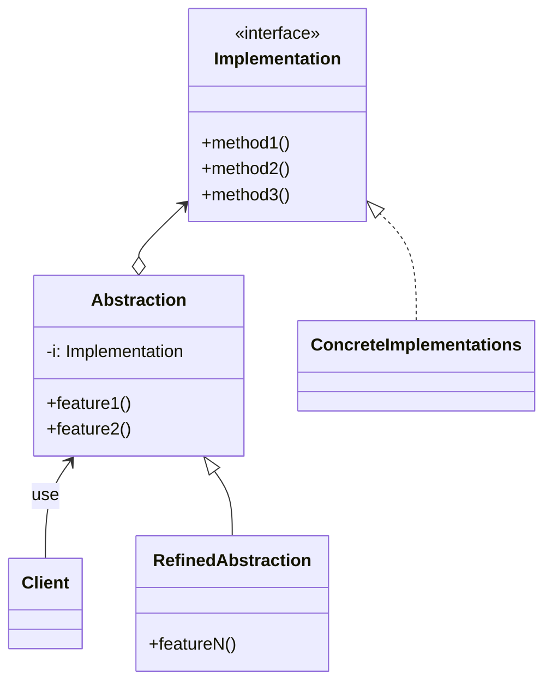

```mermaid
classDiagram
  direction BT
  class Client
  class Abstraction {
    -i: Implementation
    +feature1()
    +feature2()
  }
  class Implementation {
    <<interface>>
    +method1()
    +method2()
    +method3()
  }
  class RefinedAbstraction {
    +featureN()
  }
  class ConcreteImplementations
  
  Client --> Abstraction: use
  RefinedAbstraction --|> Abstraction
  Abstraction o--> Implementation
  ConcreteImplementations ..|> Implementation
```