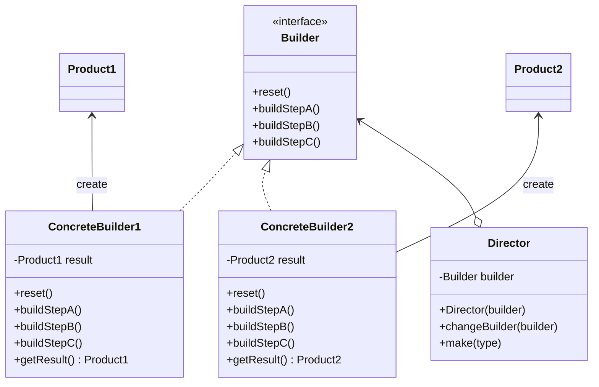

```mermaid
classDiagram
    direction BT
    class Builder {
        <<interface>>
        +reset()
        +buildStepA()
        +buildStepB()
        +buildStepC()
    }

    class ConcreteBuilder1 {
        -Product1 result
        +reset()
        +buildStepA()
        +buildStepB()
        +buildStepC()
        +getResult() Product1
    }

    class ConcreteBuilder2 {
        -Product2 result
        +reset()
        +buildStepA()
        +buildStepB()
        +buildStepC()
        +getResult() Product2
    }

    class Director {
        -Builder builder
        +Director(builder)
        +changeBuilder(builder)
        +make(type)
    }

    class Product1
    class Product2

    ConcreteBuilder1 --> Product1: create
    ConcreteBuilder2 --> Product2: create
    ConcreteBuilder1 ..|> Builder
    ConcreteBuilder2 ..|> Builder
    Director o--> Builder
```