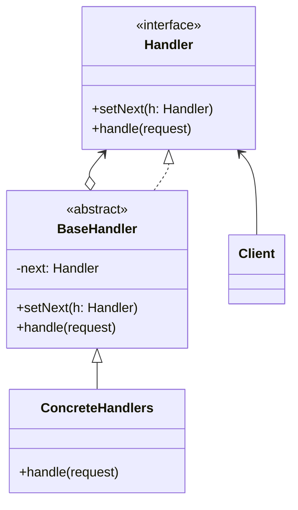

```mermaid
classDiagram
  direction BT
  class Handler {
      <<interface>>
      +setNext(h: Handler)
      +handle(request)
  }

  class BaseHandler {
      <<abstract>>
      -next: Handler
      +setNext(h: Handler)
      +handle(request)
  }

  class ConcreteHandlers {
      +handle(request)
  }

  BaseHandler o--> Handler
  BaseHandler ..|> Handler
  ConcreteHandlers --|> BaseHandler
  Client --> Handler
```