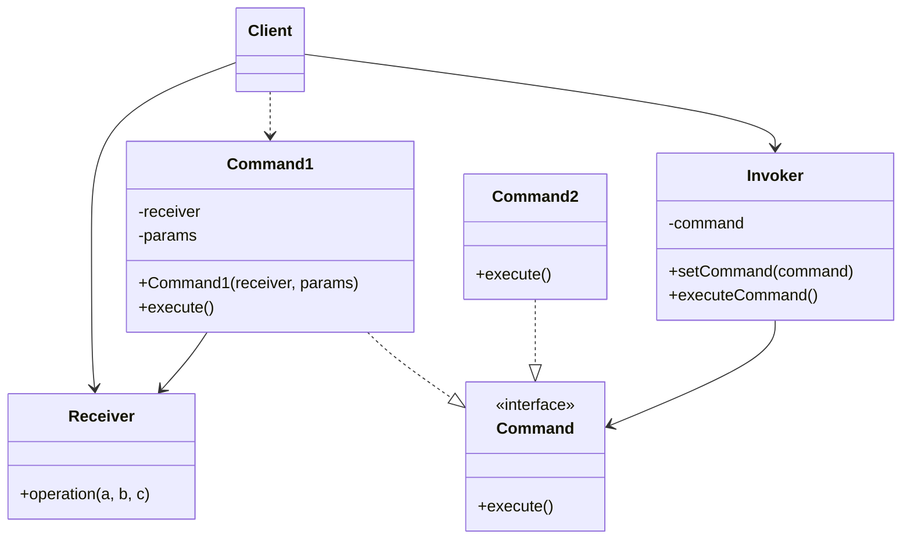

```mermaid
classDiagram
  class Client
  class Invoker {
      -command
      +setCommand(command)
      +executeCommand()
  }
  
  class Command {
      <<interface>>
      +execute()
  }

  class Command1 {
      -receiver
      -params
      +Command1(receiver, params)
      +execute()
  }

  class Command2 {
      +execute()
  }

  class Receiver {
      +operation(a, b, c)
  }
  
  Invoker --> Command
  Command1 ..|> Command
  Command1 --> Receiver
  Command2 ..|> Command

  Client --> Invoker
  Client ..> Command1
  Client --> Receiver
```