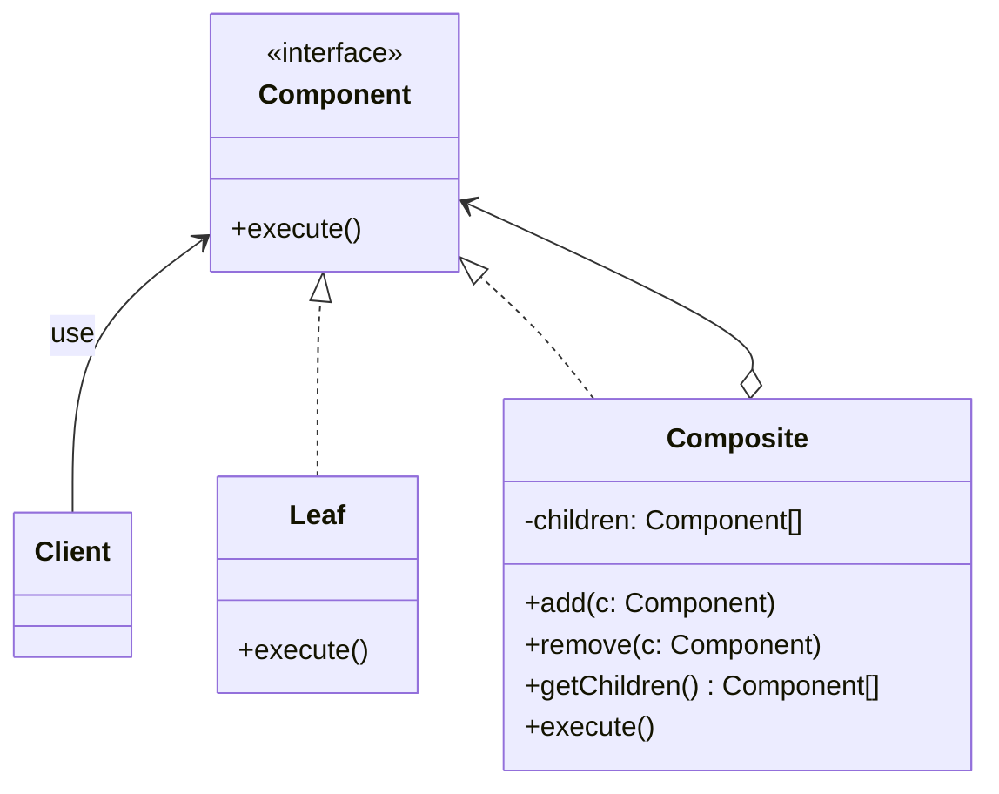

```mermaid
classDiagram
  direction BT
  class Client
  class Component {
    <<interface>>
    +execute()
  }
  class Leaf {
    +execute()
  }
  class Composite {
    -children: Component[]
    +add(c: Component)
    +remove(c: Component)
    +getChildren() Component[]
    +execute()
  }
  Client --> Component: use
  Leaf ..|> Component
  Composite ..|> Component
  Composite o--> Component 
```