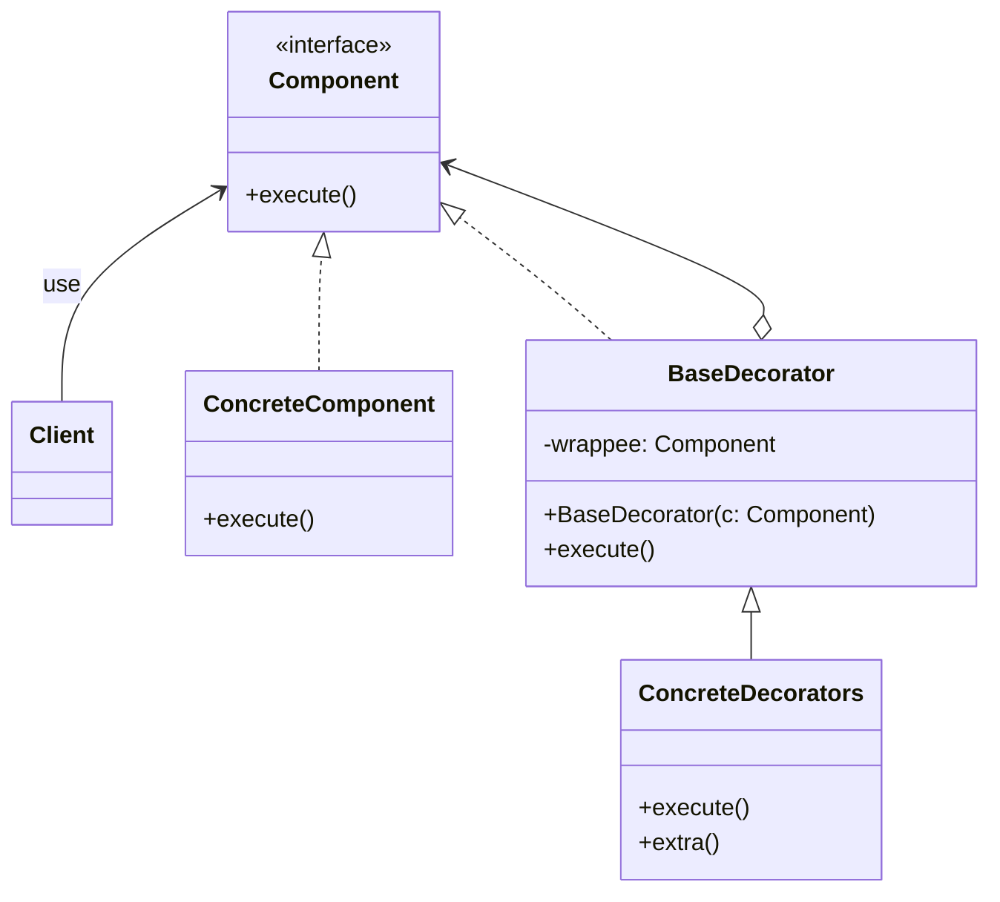

```mermaid
classDiagram
  direction BT
  class Client
  class Component {
    <<interface>>
    +execute()
  }
  class ConcreteComponent {
    +execute()
  }
  class BaseDecorator {
    -wrappee: Component
    +BaseDecorator(c: Component)
    +execute()
  }
  class ConcreteDecorators {
    +execute()
    +extra()
  }
  
  Client --> Component: use
  ConcreteComponent ..|> Component
  BaseDecorator ..|> Component
  ConcreteDecorators --|> BaseDecorator
  BaseDecorator o--> Component
```