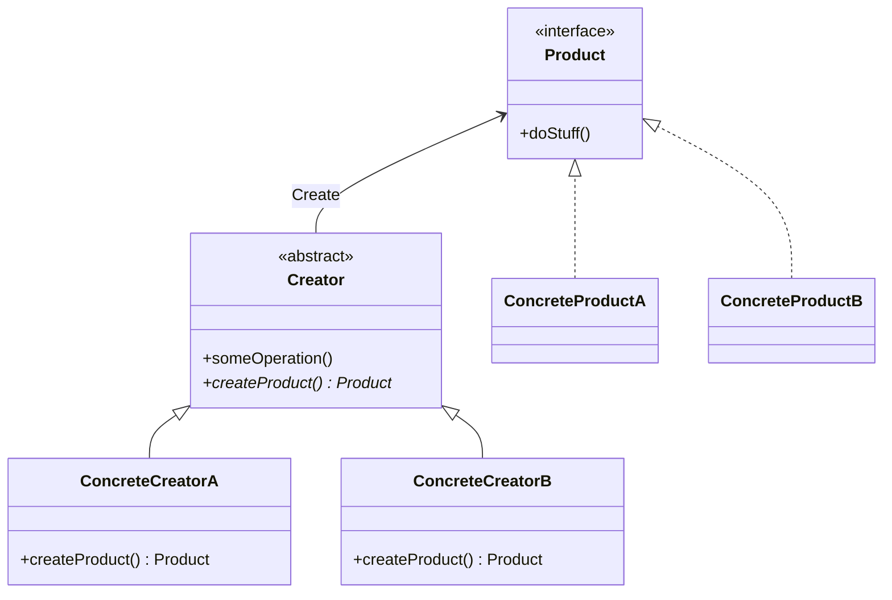

```mermaid
classDiagram
  direction BT
  class Creator{
    <<abstract>>
    +someOperation()
    +createProduct()* Product
  }
  class Product{
    <<interface>>
    +doStuff()
  }
  class ConcreteCreatorA{
    +createProduct() Product
  }
  class ConcreteCreatorB{
    +createProduct() Product
  }
  class ConcreteProductA{
  }
  class ConcreteProductB{
  }
  
  ConcreteCreatorA --|> Creator
  ConcreteCreatorB --|> Creator
  Creator --> Product : Create 
  ConcreteProductA ..|> Product
  ConcreteProductB ..|> Product
```