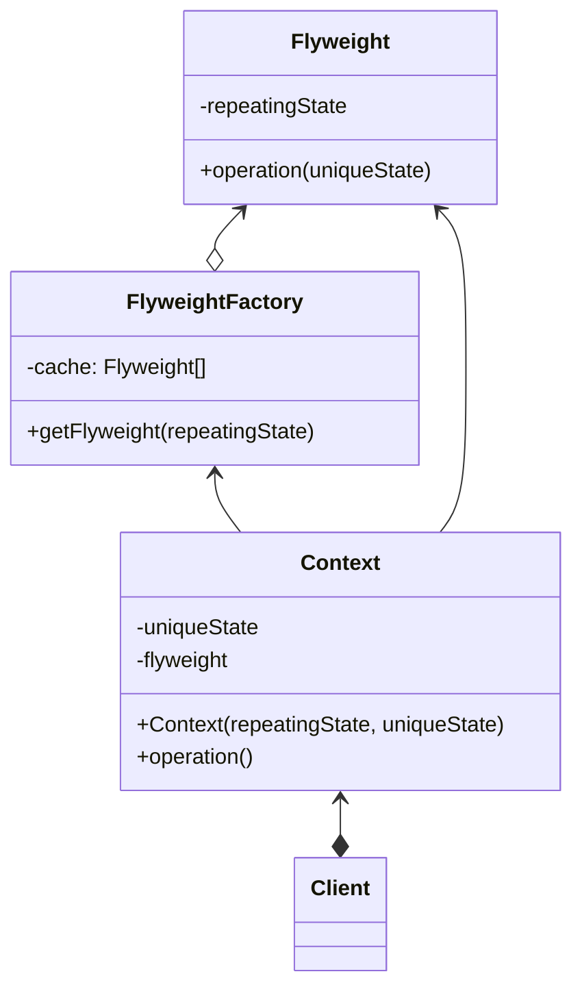

```mermaid
classDiagram
  direction BT
  class FlyweightFactory {
      -cache: Flyweight[]
      +getFlyweight(repeatingState)
  }
  class Context {
      -uniqueState
      -flyweight
      +Context(repeatingState, uniqueState)
      +operation()
  }
  class Flyweight {
      -repeatingState
      +operation(uniqueState)
  }
  FlyweightFactory o--> Flyweight
  Context --> FlyweightFactory
  Context --> Flyweight
  Client *--> Context
```