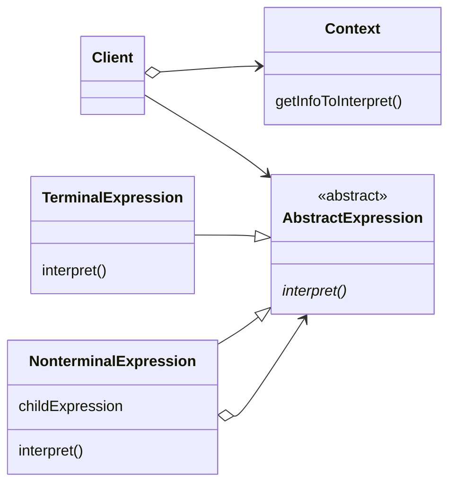

```mermaid
classDiagram
  direction LR
  class Client
  class AbstractExpression {
      <<abstract>>
      interpret()*
  }
  class TerminalExpression {
      interpret()
  }
  class NonterminalExpression {
      childExpression
      interpret()
  }
  class Context {
      getInfoToInterpret()
  }

  Client o--> Context
  Client --> AbstractExpression
  NonterminalExpression --|> AbstractExpression
  TerminalExpression --|> AbstractExpression
  NonterminalExpression o--> AbstractExpression
```