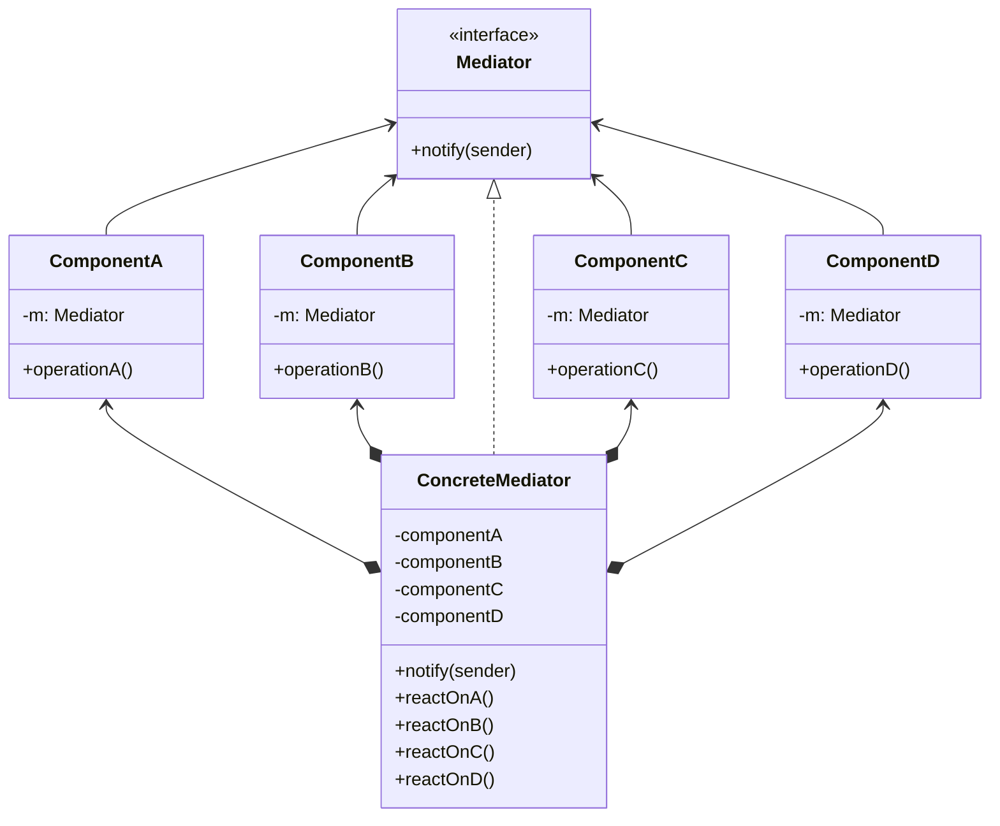

```mermaid
classDiagram
  direction BT
  class Mediator {
      <<interface>>
      +notify(sender)
  }
  class ConcreteMediator {
      -componentA
      -componentB
      -componentC
      -componentD
      +notify(sender)
      +reactOnA()
      +reactOnB()
      +reactOnC()
      +reactOnD()
  }
  class ComponentA {
      -m: Mediator
      +operationA()
  }
  class ComponentB {
      -m: Mediator
      +operationB()
  }
  class ComponentC {
      -m: Mediator
      +operationC()
  }
  class ComponentD {
      -m: Mediator
      +operationD()
  }
  ComponentA --> Mediator
  ComponentB --> Mediator
  ConcreteMediator ..|> Mediator
  ComponentC --> Mediator
  ComponentD --> Mediator
  ConcreteMediator *--> ComponentA
  ConcreteMediator *--> ComponentB
  ConcreteMediator *--> ComponentC
  ConcreteMediator *--> ComponentD
```