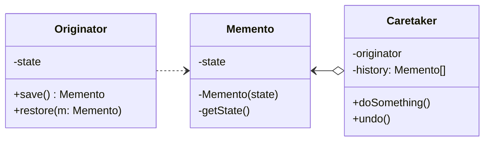

```mermaid
classDiagram
  direction LR
  class Originator {
      -state
      +save() Memento
      +restore(m: Memento)
  }
  class Memento {
      -state
      -Memento(state)
      -getState()
  }
  class Caretaker {
      -originator
      -history: Memento[]
      +doSomething()
      +undo()
  }

  Originator ..> Memento
  Memento <--o Caretaker
```