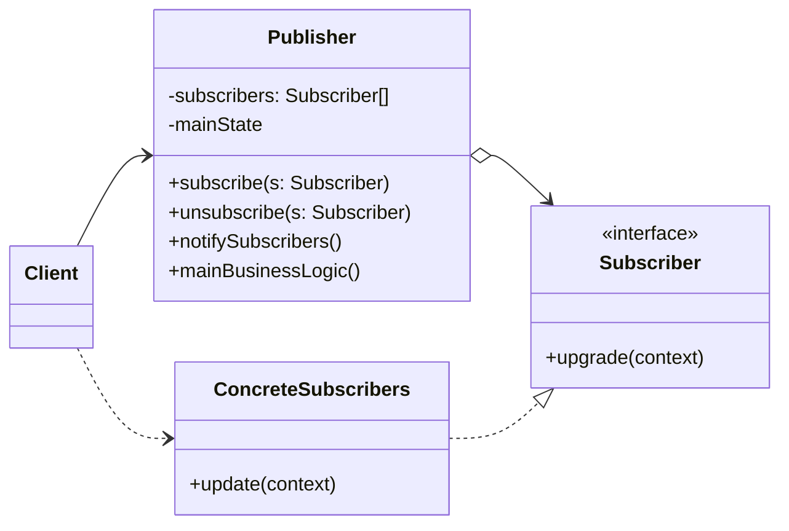

```mermaid
classDiagram
  direction LR
  class Publisher {
      -subscribers: Subscriber[]
      -mainState
      +subscribe(s: Subscriber)
      +unsubscribe(s: Subscriber)
      +notifySubscribers()
      +mainBusinessLogic()
  }
  class Subscriber {
      <<interface>>
      +upgrade(context)
  }
  class ConcreteSubscribers {
      +update(context)
  }
  class Client

  Publisher o--> Subscriber
  ConcreteSubscribers ..|> Subscriber
  Client --> Publisher
  Client ..> ConcreteSubscribers
```