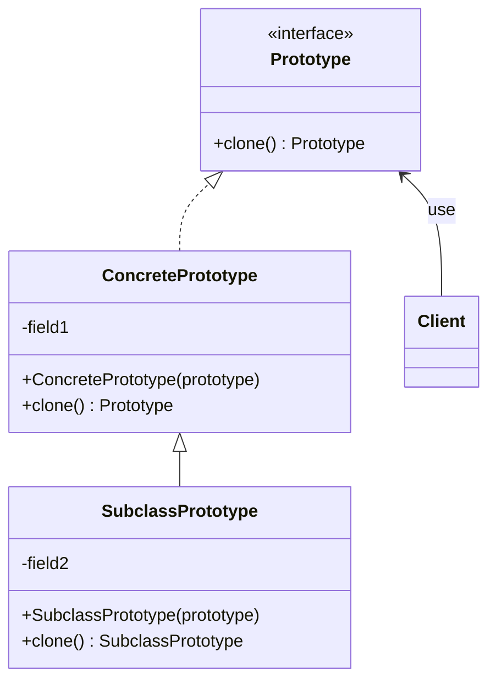

```mermaid
  classDiagram
    direction BT
    class Prototype{
      <<interface>>
      +clone() Prototype
    }

    class ConcretePrototype{
      -field1
      +ConcretePrototype(prototype)
      +clone() Prototype
    }

    class SubclassPrototype{
      -field2
      +SubclassPrototype(prototype)
      +clone() SubclassPrototype
    }
    
    class Client
    SubclassPrototype --|> ConcretePrototype
    ConcretePrototype ..|> Prototype
    Client --> Prototype : use
```