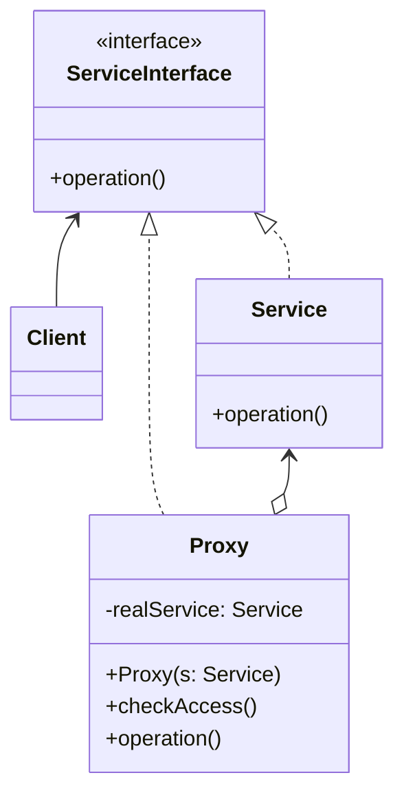

```mermaid
classDiagram
  direction BT
  class ServiceInterface {
    <<interface>>
    +operation()
  }
  class Proxy {
    -realService: Service
    +Proxy(s: Service)
    +checkAccess()
    +operation()
  }
  class Service {
    +operation()
  }
  Client --> ServiceInterface
  Proxy ..|> ServiceInterface
  Service ..|> ServiceInterface
  Proxy o--> Service
```