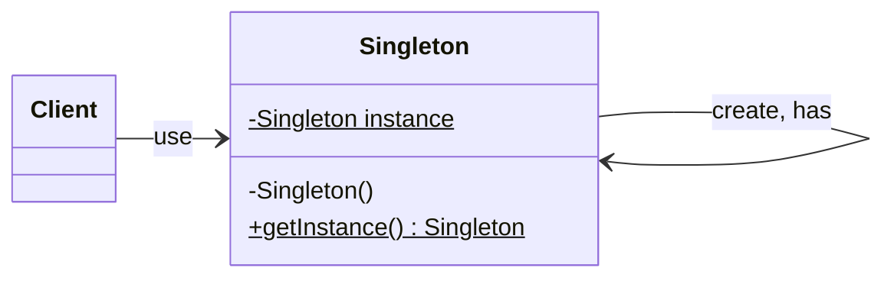

```mermaid
classDiagram
    direction LR
    class Singleton {
        -Singleton instance$
        -Singleton()
        +getInstance()$ Singleton
    }

    class Client

    Client --> Singleton : use
    Singleton --> Singleton : create, has
```