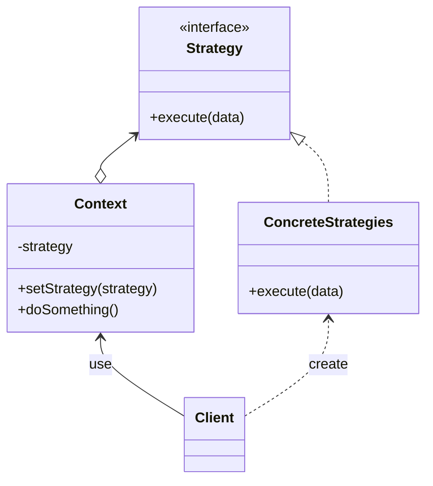

```mermaid
classDiagram
  direction BT
  class Client
  class Context{
    -strategy
    +setStrategy(strategy)
    +doSomething()
  }
  class Strategy{
    <<interface>>
    +execute(data)
  }
  class ConcreteStrategies{
    +execute(data)
  }
  Client --> Context: use
  Client ..> ConcreteStrategies: create
  Context o--> Strategy
  ConcreteStrategies ..|> Strategy
```