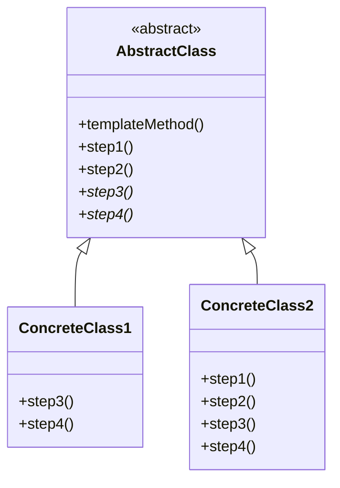

```mermaid
classDiagram
  direction BT
  class AbstractClass{
    <<abstract>>
    +templateMethod()
    +step1()
    +step2()
    +step3()*
    +step4()*
  }
  class ConcreteClass1{
    +step3()
    +step4()
  }
  class ConcreteClass2{
    +step1()
    +step2()
    +step3()
    +step4()
  }
  ConcreteClass1 --|> AbstractClass
  ConcreteClass2 --|> AbstractClass
```