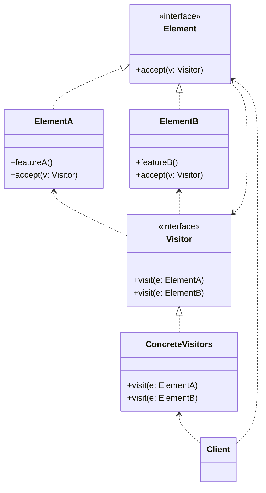

```mermaid
classDiagram
    direction BT
    class Client
    class ConcreteVisitors {
        +visit(e: ElementA)
        +visit(e: ElementB)
    }
    class Visitor {
        <<interface>>
        +visit(e: ElementA)
        +visit(e: ElementB)
    }
    class ElementA {
        +featureA()
        +accept(v: Visitor)
    }
    class ElementB {
        +featureB()
        +accept(v: Visitor)
    }
    class Element {
        <<interface>>
        +accept(v: Visitor)
    }


    Client ..> ConcreteVisitors
    ConcreteVisitors ..|> Visitor
    Element ..> Visitor
    ElementA ..|> Element
    ElementB ..|> Element
    Visitor ..> ElementA
    Visitor ..> ElementB
    Client ..> Element
```